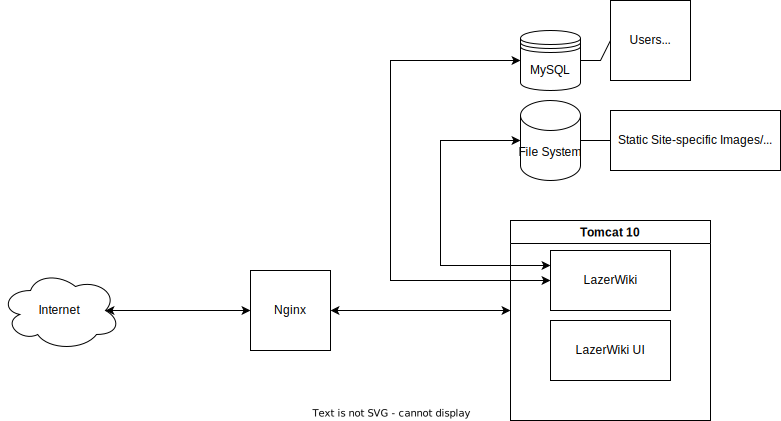

# lazerwiki
Java based wiki engine.

Development version is hosted at https://lazerwiki.lazerdwarf4life.com/

A wiki engine built in java. I was disatisfied with managing a wiki with a php backend and the awkwardness of upgrading/maintaing such an application with changing php versions.
Operates with https://github.com/calubrecht/lazerwiki-ui as a react front end.

Initial implementation is interpretting Dokuwiki-style page syntax, with a DB backend, but alternate syntax support is being considered.
Goal is to support multiple wikis using a single deployed engine, based on URL.

___

## Recommended Deployment

Lazerwiki has been tested and developed with the following infrastructure.

Nginx reverse Proxy

Tomcat 10

MySQL (or Mariadb)

LazerWiki
* Static Site Based Resources
* User-uploaded media resources.

LazerWiki-UI

