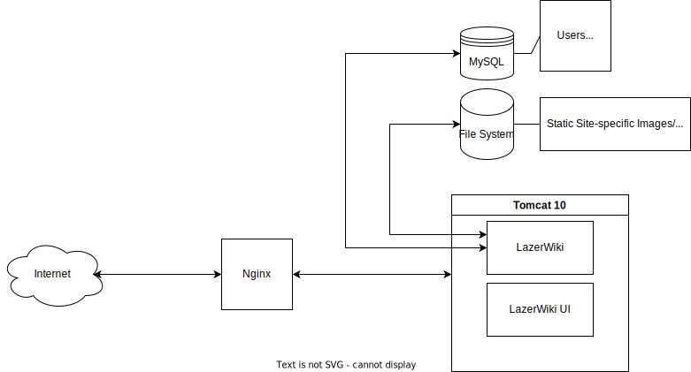

# LazerWiki

A Java-based multi-site wiki engine with a DokuWiki-compatible syntax, React front end, and an extensible macro/plugin system.

Development instance: https://lazerwiki.lazerdwarf4life.com/

Front end repository: https://github.com/calubrecht/lazerwiki-ui

---

## Features

- DokuWiki-style page markup (headers, bold/italic, links, images, tables, lists, code blocks, etc.)
- Multi-site support — one deployment serves multiple wikis distinguished by hostname
- Namespace-based page organization with per-namespace ACLs
- Page history and diff view
- Full-text search
- Media (image) upload and management
- Custom macro and plugin system (see [docs/PLUGINS.md](docs/PLUGINS.md))
- Sitemap generation
- Import/export
- Optional email notifications

---

## Technology Stack

| Component | Technology |
|-----------|-----------|
| Backend | Spring Boot 4, Java 25, JPA/Hibernate |
| Database | MySQL / MariaDB (SQLite for development) |
| Build | Gradle (Kotlin DSL) |
| Deployment | WAR on Tomcat 10 |
| Reverse proxy | Nginx |
| Front end | React (separate repo) |

---

## Building

### Prerequisites

- JDK 25+
- Gradle (wrapper included)

### Build the WAR

```bash
./gradlew war
```

The WAR is written to `build/libs/lazerwiki-<version>.war`.

### Build the Macro API jar

The macro API jar contains the `Macro` and `Plugin` base classes needed to write custom extensions outside the main codebase:

```bash
./gradlew macroApiJar
```

### Build the local macros jar

If you have macros in `src/main/java/localMacros/`, package them as a separate jar:

```bash
./gradlew localMacroJar
```

### Run tests

```bash
./gradlew test
```

Tests use an in-memory H2 database and do not require MySQL.

### Code style

Before opening a pull request, please run the formatter and style checks:

```bash
# Auto-format all Java source files
./gradlew spotlessApply

# Check for remaining style violations (naming, braces, etc.)
./gradlew checkstyleMain checkstyleTest
```

`spotlessApply` uses google-java-format to fix whitespace and formatting automatically. `checkstyle` catches naming conventions and structural issues that require manual fixes. Both should be clean before merging.

## Spots Bug

Also run the spots bug check, as a failure will break the build.

```bash
./gradlew spotbugsMain
```

If necessary, extend config/spotbugs/exclude.xml, but add comment defending reasoning to ignore the warning

---

## Configuration

Copy `src/main/resources/application.properties` to your deployment and fill in the following:

### Database

```properties
lazerwiki.datasource.url=jdbc:mysql://localhost:3306/lazerwiki
lazerwiki.datasource.username=<db-user>
lazerwiki.datasource.password=<db-password>
lazerwiki.db.engine=mysql          # mysql | sqlite
```

Initialize the schema with `src/main/sql/create.sql` (MySQL) or `src/main/sql/create.sqlite` (SQLite).

### Web server

```properties
webserver.urlprefix=/app           # path prefix under which the WAR is deployed
webserver.frontend=                # URL of the React UI (if served separately)
```

### File storage

```properties
lazerwiki.static.file.root=static  # root directory for site templates and uploaded media
```

The directory structure under this root is:

```
static/
  <site-name>/
    resources/       # static assets served to the browser (site.css, favicon.ico, etc.)
    media/           # user-uploaded media, organized by namespace subdirectory
    media-cache/     # auto-generated scaled image cache
  tmp/
    exports/         # temporary export archives
```

### Macros and plugins

```properties
# Comma-separated list of Java packages to scan for @CustomMacro and @WikiPlugin classes
lazerwiki.plugin.scan.packages=us.calubrecht.lazerwiki.exampleMacros,us.calubrecht.lazerwiki.examplePlugins,localMacros
```

### Email (optional)

```properties
spring.mail.host=
spring.mail.port=
spring.mail.username=
spring.mail.password=
lazerwiki.email.smtp.src.email=
lazerwiki.email.smtp.src.name=
```

### Other

```properties
lazerWiki.default.site.title=Lazerwiki
page.lock.minutes=20               # how long an edit lock is held
imageutil.image.size.limit=100000000   # max image size in bytes
lazerwiki.unscalable-image.ext=avif    # comma-separated extensions that cannot be resized
spring.servlet.multipart.max-file-size=5MB
spring.servlet.multipart.max-request-size=5MB
```

---

## Deployment

LazerWiki is deployed as a WAR on Tomcat 10 sitting behind an Nginx reverse proxy.

```
Browser → Nginx → Tomcat (LazerWiki WAR)
                → Static files (LazerWiki-UI)
```

See [docs/nginxLazerwiki.conf](docs/nginxLazerwiki.conf) for a reference Nginx configuration.



### First-time setup

1. Create the database and run `src/main/sql/create.sql`.
2. Deploy the WAR to Tomcat and configure `application.properties`.
3. Create the first admin user:

```bash
java -jar lazerwiki.war -createAdminUser
```

You will be prompted for a username and password interactively.

---

## Architecture

See [docs/ARCHITECTURE.md](docs/ARCHITECTURE.md) for a detailed description of the service layers, rendering pipeline, and multi-site model.

---

## Writing Macros and Plugins

See [docs/PLUGINS.md](docs/PLUGINS.md) for the full macro and plugin API reference with examples.
